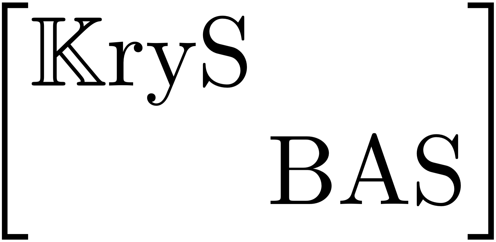

[](https://github.com/nidtec-una/krysbas-dev/actions/workflows/matlab_tests.yaml)
[](https://github.com/nidtec-una/krysbas-dev/actions/workflows/code_style.yml)
[](https://github.com/nidtec-una/krysbas-dev/actions/workflows/julia_tests.yml)
[](https://github.com/nidtec-una/krysbas-dev/actions/workflows/julia_style.yml)
[](https://codecov.io/gh/nidtec-una/krysbas-dev)
[](https://krysbas-dev.readthedocs.io/en/latest/?badge=latest)
[](https://github.com/nidtec-una/krysbas-dev/actions/workflows/julia_docs.yml)
[](https://www.gnu.org/licenses/lgpl-3.0)

# KrySBAS: Krylov Subspace-Based Adaptive Solvers

<p align="center">
  
</p>


KrySBAS is a free and open-source toolbox of adaptive iterative solvers for sparse linear systems (*Ax = b*), based on Krylov subspaces. It is available for both **MATLAB/GNU-Octave** and **Julia**.

The toolbox is developed by the [Scientific Computing and Applied Mathematics](https://nidtec.pol.una.py/ccyma/) group at the [NIDTEC](https://nidtec.pol.una.py/) research center of the [Polytechnic Faculty, National University of Asunción, Paraguay](https://www.pol.una.py/).

## Installation

### MATLAB

Clone this repository and add the source directory to your MATLAB path:

```matlab
addpath(genpath('matlab/src'))
```

### Julia

The Julia package lives in the `julia/` subdirectory. Activate and instantiate it once:

```julia
using Pkg
Pkg.activate("julia/")
Pkg.instantiate()
```

Then load the package in your code:

```julia
using KrySBAS
```

## Solvers catalogue

All solvers share the same output signature: `x, flag, relresvec, kdvec, time`.

### GMRES-E(*m, d*) — [Morgan, 1995](https://epubs.siam.org/doi/abs/10.1137/S0895479893253975)

Restarted GMRES augmented with *d* harmonic Ritz vectors approximating the smallest eigenvalues of the Krylov subspace.

**MATLAB**
```matlab
[x, flag, relresvec, kdvec, time] = gmres_e(A, b, m, d, tol, maxit, xInitial, eigstol)
```

**Julia**
```julia
x, flag, relresvec, kdvec, time = gmres_e(A, b; m=10, d=3, tol=1e-6, maxit=10, x_initial=zeros(n))
```

### LGMRES(*m, l*) — [Baker, Jessup & Manteuffel, 2005](https://epubs.siam.org/doi/abs/10.1137/S0895479803422014)

Restarted GMRES augmented with *l* error approximation vectors from prior restart cycles, preserving information from discarded search subspaces.

**MATLAB**
```matlab
[x, flag, relresvec, kdvec, time] = lgmres(A, b, m, l, tol, maxit, xInitial)
```

**Julia**
```julia
x, flag, relresvec, kdvec, time = lgmres(A, b; m=10, l=3, tol=1e-6, maxit=10, x_initial=zeros(n))
```

### PD-GMRES(*m*) — [Núñez, Schaerer & Bhaya, 2018](https://www.sciencedirect.com/science/article/pii/S037704271830030X)

Restarted GMRES with a Proportional-Derivative (PD) controller that automatically adapts the restart parameter *m* each cycle.

**MATLAB**
```matlab
[x, flag, relresvec, kdvec, time] = pd_gmres(A, b, mInitial, mMinMax, mStep, tol, maxit, xInitial, alphaPD)
```

**Julia**
```julia
x, flag, relresvec, kdvec, time = pd_gmres(A, b; m_initial=10, m_min_max=nothing, m_step=1,
                                             tol=1e-6, maxit=10, x_initial=zeros(n), alpha_pd=[-3.0, 5.0])
```

## Contributing

If you wish to contribute to KrySBAS, please read the [developer guide](https://github.com/nidtec-una/krysbas-dev/blob/dev_guide/dev_guide.md) before opening a pull request.

## Feature requests and bug reports

For feature requests and bug reports, please create an [issue](https://github.com/nidtec-una/krysbas-dev/issues). For bug reports, please provide a minimal working example that reproduces the error.
